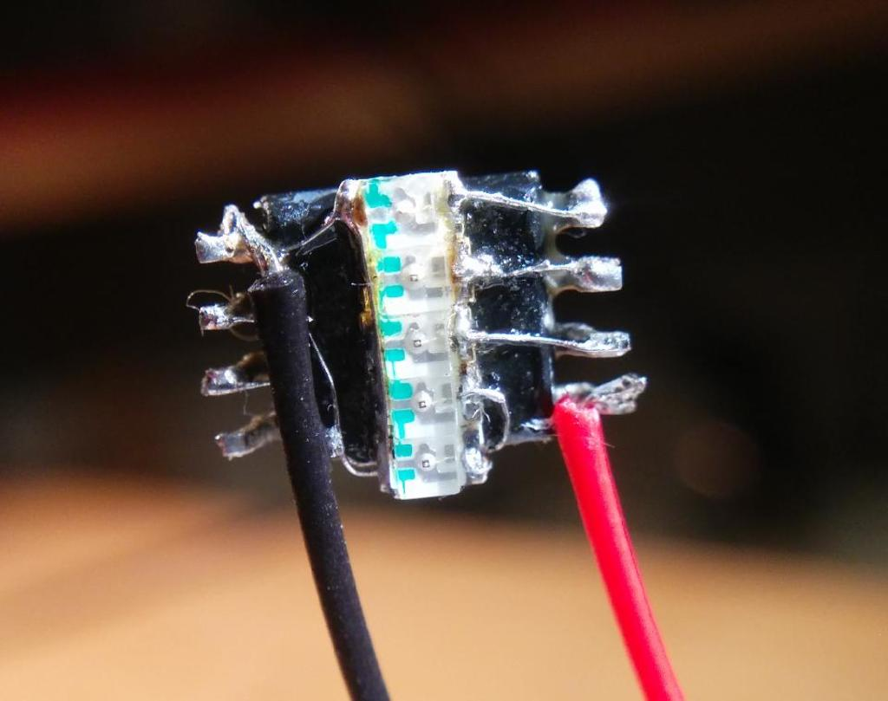

# attiny-tiny-pov
A persistence of vision (POV) display with five 0805 LEDs piggy back on an ATTiny13.

Documentation on [Hackaday.io](https://hackaday.io/project/29540-tiny-pov).
In action: [YouTube](https://youtu.be/9anE3Tc2hCU).

# Pattern generation

The displayed pattern is hardcoded into the program. You can either manually
edit the bitpattern in pov.c (const uint8_t data[] ...) or include a generated
C file.

See banner1.txt for a template for the generated C file. "X" is LED on, " " off.
The awk script will generate a C include from it

> ./banner_txt2c.awk < banner1.txt > banner1.inc

or just

> make banner1.inc

# Compile, generate pattern and flash with usbasb programmer

> make flash

